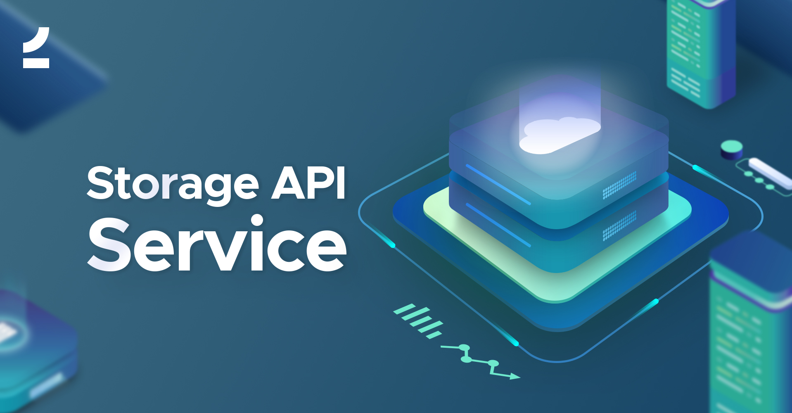

  
  
The Storage service is a microservice that stores files using [league/flysystem]((https://github.com/thephpleague/flysystem)) filesystem abstraction.

It was built to allow our development teams at [2amigos](https://2amigos.us) to avoid having to configure storage adapters over and over on projects   
involving a microservices infrastructure. It's a combination of two separate applications, one being Symfony's CI application and the other being an API built with Slim3.    
  
The project uses [Monolog](https://github.com/Seldaek/monolog) for logging, [Fractal](http://fractal.thephpleague.com/) as a serializer, [Tactitian](https://tactician.thephpleague.com/) as a command bus, [Basic access authentication](https://en.wikipedia.org/wiki/Basic_access_authentication) and [Json Web Tokens](https://jwt.io/)   for authentication (this is optional), [Zend filter](https://docs.zendframework.com/zend-filter/) for data filtering and validation, and [Phinx](http://docs.phinx.org/en/latest/) for database migrations.
  
[Docker compose](https://docs.docker.com/compose/overview/) and [Postman collection](https://www.getpostman.com/) files are included for easy development, even though `docker` is not strictly necessary for development as you could easily use the built-in PHP server.
  
This project tries to follow DDD principles.
  
## Install  
  
Install the latest version using [composer](https://getcomposer.org/).  
  
``` bash  
$ composer create-project --no-interaction --stability=dev 2amigos/storage-service app  
```  
  
If you are using it from a private repository (using a github url here as an example).  
  
``` bash 
$ composer create-project --no-interaction --stability=dev 2amigos/storage-service app --repository-url=https://github.com/2amigos/storage-service  
```

## Configuration  
  
The project uses environment files to configure secrets. For that reason, you must create a file named `.env` in the root directory of the project. An `.env.example` file has been provided with all required environment values. Modify that file and save it as `.env` in the root directory.  
  
By default, the API application is configured to work under basic authentication processes. It uses an array of users for that purpose but you could easily change that behavior by configuring the `authenticator` option of the [HttpBasicAuthentication middleware(https://github.com/tuupola/slim-basic-auth/blob/3.x/src/HttpBasicAuthentication.php#L43) by creating your own or using one provided by the library. Check the [PdoAuthenticator](https://github.com/tuupola/slim-basic-auth/blob/3.x/src/HttpBasicAuthentication/PdoAuthenticator.php).   
  
If authentication is successful, the action will return a Json Web Token to be used for subsequent calls.   
  
Authentication, or the usage of scopes, are optional. If you don't wish to work with this kind of setup, simply remove the middleware configurations of `HttpBasicAuthentication`, `JwtAuthentication` and `ScopeMiddleware` middlewares.

# Usage  
Create a database with the credentials that you used in `.env`   file. Now you can run [Phinx](http://docs.phinx.org/en/latest/commands.html) database migrations with this command: 

``` bash  
./vendor/bin/phinx migrate -e development
``` 
For the sake of this example, go to the `public` folder of the app and start the built-in PHP server like this:   
  
``` bash  
php -S localhost:8080  
```   
Now we can access the api at `http://127.0.0.1:8080`.
## Get a token   
To get a token, use the following:  
  
``` bash  
$ curl "https://127.0.0.1:8080/token" \  
 --request POST \ --include \ --insecure \ --header "Content-Type: application/json" \ --data '["mail.all"]' \ --user test:test  
HTTP/1.1 201 Created  
Content-Type: application/json  
  
{  
 "data": { "token": "XXXXXXXXXX", "expires": 1550271641 }
 }
 ```
## Storing a document

### Synchronous  
  
Using the `token`, you can now post a request using `application/form-data` to store a document.   
  
``` bash   
$ curl -X POST \  
 https://127.0.0.1:8080/document/store \ -H 'Authorization: Bearer YOUR_TOKEN_HERE' \ -H 'Cache-Control: no-cache' \ -H 'Content-Type: application/x-www-form-urlencoded' \ -H 'Postman-Token: 22bf2715-35e4-41ee-a04b-fd8beddcdd62' \ -H 'content-type: multipart/form-data; boundary=----WebKitFormBoundary7MA4YWxkTrZu0gW' \ -F name=nameofthedocument \ -F async=false \ -F 'document=@/path/to/document/to/attach/41835188_10217308479844850_6484466208170049536_o.jpg'  
 ```
  
The above command will create an email message on the spool directory, configured by default at the `runtime` folder.

### Asynchronous
  
#### Sending a document to the queue
[Enqueue](https://github.com/php-enqueue/fs) is default queue  service and it is configured to use `runtime/queue` directory.
  
``` bash   
curl -X POST \  
 https://127.0.0.1:8080/document/store \ -H 'Authorization: Bearer YOUR_TOKEN_HERE' \ -H 'Cache-Control: no-cache' \ -H 'Content-Type: application/x-www-form-urlencoded' \ -H 'Postman-Token: 22bf2715-35e4-41ee-a04b-fd8beddcdd62' \ -H 'content-type: multipart/form-data; boundary=----WebKitFormBoundary7MA4YWxkTrZu0gW' \ -F name=nameofthedocument \ -F async=true \ -F 'document=@/path/to/document/to/attach/41835188_10217308479844850_6484466208170049536_o.jpg'  
 ```
  
The above command will create an email message on the spool directory, configured by default at the `runtime` folder.

#### Getting document from the queue and storing it
We use [Enqueue Filesystem Transport](https://github.com/php-enqueue/fs) to ease the task of storing documents from the queue as it comes with some handy commands. 

The [php-enqueue/enqueue-bundle](https://github.com/php-enqueue/enqueue-bundle) comes with a set of pretty handy commands. For the full reference of those commands, please go to [its documentation](https://github.com/php-enqueue/enqueue-dev/blob/master/docs/bundle/cli_commands.md).   
  
The one to consume all the documents that go to the queue is `enqueue:consume`:
`./bin/console enqueue:consume storage --no-interaction -vvv --receive-timeout=60000`
The endpoint response will have the document's uuid which you can use in other calls:
```
{
    "data": {
        "success": true,
        "status": 3,
        "uuid": "136b4cdf-736e-488a-a427-b1d1114f376d"
    }
}
```
## Pagination
For pagination you can use [Pagerfanta](https://github.com/whiteoctober/Pagerfanta) or Cursor. You can use either, it depends on your configuration inside `dependencies.php` - `$container['paginator'] = $container['paginator.pagerfanta'];` If you want to read more about Fractal pagination, you can do it here [Fractal Pagination](https://fractal.thephpleague.com/pagination/)

### Examples:

#### Pagerfanta 
`https://127.0.0.1:8080/documents/list?filter=limit(3|1):order(created_at|desc)`
In response you will see something like this:
```
"meta": {
        "pagination": {
            "total": 17,
            "count": 3,
            "per_page": 3,
            "current_page": 2,
            "total_pages": 6,
            "links": {
                "previous": "https://127.0.0.1:8080/documents/list?filter=limit(3|1):order(created_at|desc)",
                "next": "https://127.0.0.1:8080/documents/list?filter=limit(3|3):order(created_at|desc)"
            }
        }
    }
```
Also notice that you have next and previous links that you can use.

#### Cursor
`https://127.0.0.1:8080/documents/list?cursor=limit(3|2)`
Where `3` is the limit and `2` is a starting ID that is used as a cursor. You will get something like this:
```
"meta": {
        "cursor": {
            "current": "2",
            "prev": null,
            "next": "4",
            "count": 3
        }
    }
```
## Testing
For testing we are using [PHPUnit](https://phpunit.readthedocs.io/en/8.0/)

### Set Up
To set up your testing environment, a few steps are needed:
 - create `.env.test` file. You can use `.env.example` and modify it's values to create test file. Value of`APP_ENV` should be `test`
 - create a testing database and use values from your `env.test` file.
 - run a migration to populate the test database `./vendor/bin/phinx migrate -e testing`
 - change env file being used in `./phinx.php` to `.env.test`
 
### Running tests
First you need to run your local test server. Go to the `public/test/` directory and use this command:
`php -S localhost:8081`

If there are no errors, you should see that the test server is listening on the port `8081` - 
`Listening on http://localhost:8081`

Finally run tests with this command:
`./vendor/bin/phpunit --testdox tests --bootstrap tests/autoload.php`

# Contributing   
To contribute, please read our [CONTRIBUTION guidelines](CONTRIBUTING.md).  
  
# Credits  
  
- [Tuupola slim api skeleton](https://github.com/tuupola/slim-api-skeleton) Thanks for the boilerplate inspiration!  
- [2amigos](https://2amigos.us)  
- [All Contributors](../../contributors)  
  
# License  
  
The BSD License (BSD). Please see [License File](LICENSE.md) for more information.  
  
> [](http://www.2amigos.us)  
> <i>Beyond Software</i>  
> [www.2amigos.us](http://www.2amigos.us)
